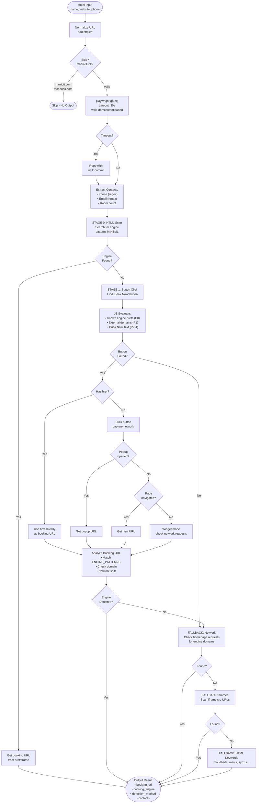
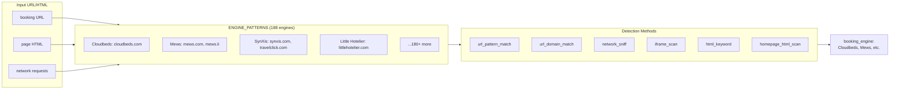
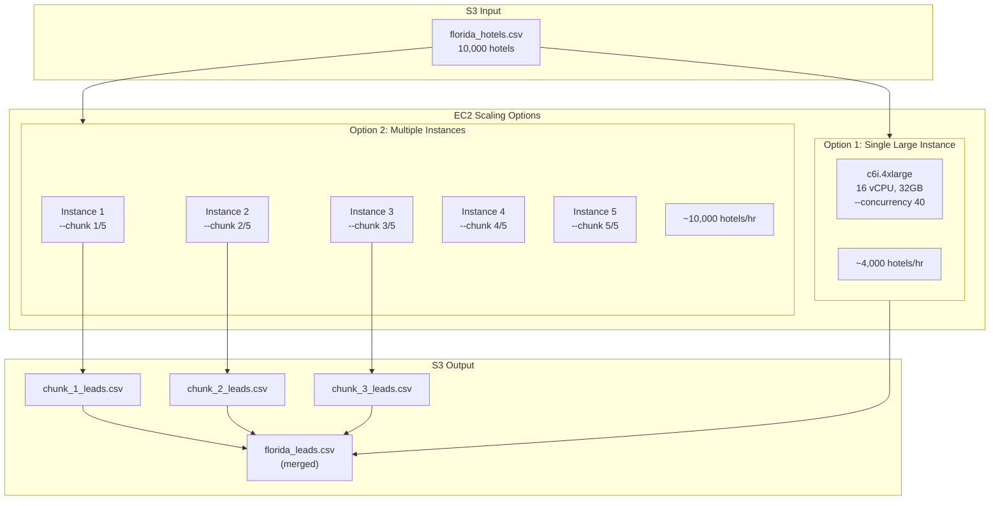

# Sadie Pipeline Architecture

## Complete Flow Diagram

```mermaid
flowchart TB
    subgraph LOCAL["🖥️ LOCAL MAC"]
        direction TB

        subgraph SCRAPING["Phase 1: Scraping"]
            direction LR
            OSM[("OSM API<br/>Overpass")]
            SERPER[("Serper API<br/>Google Maps")]

            OSM_SCRIPT["sadie_scraper_osm.py"]
            SERPER_SCRIPT["sadie_scraper_serper.py"]
            ZIP_SCRIPT["sadie_scraper_zipcode.py"]

            OSM --> OSM_SCRIPT
            SERPER --> SERPER_SCRIPT
            SERPER --> ZIP_SCRIPT
        end

        subgraph SCRAPER_OUTPUT["scraper_output/florida/"]
            direction LR
            MIAMI_CSV["miami.csv"]
            TAMPA_CSV["tampa.csv"]
            ORLANDO_CSV["orlando.csv"]
            OTHER_CSV["...22 cities"]
        end

        OSM_SCRIPT --> SCRAPER_OUTPUT
        SERPER_SCRIPT --> SCRAPER_OUTPUT
        ZIP_SCRIPT --> SCRAPER_OUTPUT

        SYNC_UP["sync_to_s3.sh<br/>📤 Upload"]
    end

    SCRAPER_OUTPUT --> SYNC_UP

    subgraph S3["☁️ AWS S3 - sadie-pipeline"]
        direction TB
        S3_INPUT["📁 input/florida/<br/>├── miami.csv<br/>├── tampa.csv<br/>└── ..."]
        S3_OUTPUT["📁 output/florida/<br/>├── miami_leads.csv<br/>├── tampa_leads.csv<br/>└── ..."]
    end

    SYNC_UP -->|"aws s3 sync"| S3_INPUT

    subgraph EC2["⚡ AWS EC2 - c6i.2xlarge"]
        direction TB

        subgraph DOWNLOAD["Step 1: Download"]
            EC2_DOWNLOAD["Download from S3<br/>→ /tmp/input/"]
        end

        subgraph DETECTOR["Step 2: Detection (Parallel)"]
            direction TB

            subgraph WORKER_POOL["Worker Pool (--concurrency 20)"]
                W1["Worker 1"]
                W2["Worker 2"]
                W3["Worker 3"]
                WN["Worker N..."]
            end

            subgraph PER_HOTEL["Per Hotel Processing"]
                direction TB
                LOAD["1. Load Homepage<br/>playwright goto()"]
                CONTACTS["2. Extract Contacts<br/>phone, email, rooms"]
                HTML_SCAN["3. Scan HTML<br/>for engine patterns"]
                BUTTON["4. Find Book Button<br/>JS evaluate"]
                CLICK["5. Click & Navigate<br/>capture network"]
                ANALYZE["6. Analyze Booking Page<br/>detect engine"]
                FALLBACK["7. Fallbacks<br/>iframe, network, HTML"]
            end

            LOAD --> CONTACTS --> HTML_SCAN --> BUTTON --> CLICK --> ANALYZE --> FALLBACK
        end

        subgraph LOCAL_SAVE["Step 3: Local Checkpoint"]
            EC2_LOCAL["💾 /tmp/output/<br/>Incremental saves<br/>every 5 hotels"]
        end

        subgraph UPLOAD["Step 4: Upload"]
            EC2_UPLOAD["Upload to S3<br/>final results"]
        end

        EC2_DOWNLOAD --> DETECTOR
        DETECTOR --> LOCAL_SAVE
        LOCAL_SAVE --> EC2_UPLOAD
    end

    S3_INPUT -->|"boto3 download"| EC2_DOWNLOAD
    EC2_UPLOAD -->|"boto3 upload"| S3_OUTPUT

    subgraph LOCAL_POST["🖥️ LOCAL MAC - Post-processing"]
        direction TB

        SYNC_DOWN["sync_from_s3.sh<br/>📥 Download"]

        subgraph POSTPROCESS["Phase 3: Post-processing"]
            direction TB
            DEDUPE["sadie_dedupe.py<br/>Remove duplicates"]
            SPLIT["sadie_split_by_city.py<br/>Split by coordinates"]
            ENRICH["sadie_room_enricher_llm.py<br/>Enrich room counts"]
            EXCEL["sadie_excel_export.py<br/>Generate Excel"]
        end

        subgraph FINAL_OUTPUT["detector_output/florida/"]
            LEADS_CSV["florida_leads.csv"]
            CITY_CSVS["city/*.csv"]
            EXCEL_FILE["florida_leads.xlsx"]
        end

        ONEDRIVE["☁️ OneDrive<br/>sync_to_onedrive.sh"]
    end

    S3_OUTPUT -->|"aws s3 sync"| SYNC_DOWN
    SYNC_DOWN --> DEDUPE
    DEDUPE --> SPLIT --> ENRICH --> EXCEL
    EXCEL --> FINAL_OUTPUT
    FINAL_OUTPUT --> ONEDRIVE
```



## Detailed Detection Flow (Per Hotel)



## Engine Detection Patterns



## Parallel Scaling on EC2



## File Structure

```
sadie_gtm/
├── scripts/
│   ├── scrapers/
│   │   ├── osm.py              # OpenStreetMap scraper
│   │   ├── serper.py           # Google Maps via Serper
│   │   └── zipcode.py          # Zipcode-based scraper
│   ├── pipeline/
│   │   ├── detect.py           # Main detector (this doc)
│   │   ├── postprocess.py      # Dedupe, clean
│   │   └── export_excel.py     # Excel export
│   └── utils/
│       ├── dedupe.py
│       ├── split_by_city.py
│       └── room_enricher_llm.py
├── scraper_output/
│   └── florida/
│       ├── miami.csv
│       ├── tampa.csv
│       └── ...
├── detector_output/
│   └── florida/
│       ├── florida_leads.csv
│       └── city/
│           ├── miami.csv
│           └── ...
├── sync_to_s3.sh               # Upload to S3
├── sync_from_s3.sh             # Download from S3
└── run_pipeline.sh             # Full local pipeline
```
