# Sadie Pipeline Architecture

## Complete Flow Diagram


## Detailed Detection Flow (Per Hotel)

```mermaid
flowchart TB
    START([Hotel Input<br/>name, website, phone])

    START --> NORMALIZE["Normalize URL<br/>add https://"]

    NORMALIZE --> SKIP_CHECK{"Skip?<br/>Chain/Junk?"}
    SKIP_CHECK -->|"marriott.com<br/>facebook.com"| SKIP_END([Skip - No Output])

    SKIP_CHECK -->|Valid| GOTO["playwright.goto()<br/>timeout: 30s<br/>wait: domcontentloaded"]

    GOTO --> GOTO_FAIL{Timeout?}
    GOTO_FAIL -->|Yes| FALLBACK_GOTO["Retry with<br/>wait: commit"]
    FALLBACK_GOTO --> EXTRACT
    GOTO_FAIL -->|No| EXTRACT

    EXTRACT["Extract Contacts<br/>• Phone (regex)<br/>• Email (regex)<br/>• Room count"]

    EXTRACT --> STAGE0["STAGE 0: HTML Scan<br/>Search for engine<br/>patterns in HTML"]

    STAGE0 --> STAGE0_FOUND{Engine<br/>Found?}
    STAGE0_FOUND -->|Yes| GET_BOOKING_URL["Get booking URL<br/>from href/iframe"]
    STAGE0_FOUND -->|No| STAGE1

    GET_BOOKING_URL --> DONE

    STAGE1["STAGE 1: Button Click<br/>Find 'Book Now' button"]

    STAGE1 --> FIND_BUTTON["JS Evaluate:<br/>• Known engine hrefs (P0)<br/>• External domains (P1)<br/>• 'Book Now' text (P2-4)"]

    FIND_BUTTON --> BUTTON_FOUND{Button<br/>Found?}
    BUTTON_FOUND -->|No| NETWORK_FALLBACK

    BUTTON_FOUND -->|Yes| HAS_HREF{Has href?}
    HAS_HREF -->|Yes| USE_HREF["Use href directly<br/>as booking URL"]
    HAS_HREF -->|No| CLICK_BUTTON["Click button<br/>capture network"]

    CLICK_BUTTON --> POPUP{Popup<br/>opened?}
    POPUP -->|Yes| POPUP_URL["Get popup URL"]
    POPUP -->|No| NAV_CHECK{Page<br/>navigated?}
    NAV_CHECK -->|Yes| NAV_URL["Get new URL"]
    NAV_CHECK -->|No| WIDGET["Widget mode<br/>check network requests"]

    USE_HREF --> ANALYZE_URL
    POPUP_URL --> ANALYZE_URL
    NAV_URL --> ANALYZE_URL
    WIDGET --> ANALYZE_URL

    ANALYZE_URL["Analyze Booking URL<br/>• Match ENGINE_PATTERNS<br/>• Check domain<br/>• Network sniff"]

    ANALYZE_URL --> ENGINE_FOUND{Engine<br/>Detected?}
    ENGINE_FOUND -->|Yes| DONE
    ENGINE_FOUND -->|No| NETWORK_FALLBACK

    NETWORK_FALLBACK["FALLBACK: Network<br/>Check homepage requests<br/>for engine domains"]

    NETWORK_FALLBACK --> NET_FOUND{Found?}
    NET_FOUND -->|Yes| DONE
    NET_FOUND -->|No| IFRAME_FALLBACK

    IFRAME_FALLBACK["FALLBACK: Iframes<br/>Scan iframe src URLs"]

    IFRAME_FALLBACK --> IFRAME_FOUND{Found?}
    IFRAME_FOUND -->|Yes| DONE
    IFRAME_FOUND -->|No| HTML_FALLBACK

    HTML_FALLBACK["FALLBACK: HTML Keywords<br/>cloudbeds, mews, synxis..."]

    HTML_FALLBACK --> DONE

    DONE([Output Result<br/>• booking_url<br/>• booking_engine<br/>• detection_method<br/>• contacts])
```



## Engine Detection Patterns


## Parallel Scaling on EC2


## File Structure

```
sadie_gtm/
├── scripts/
│   ├── scrapers/
│   │   ├── osm.py              # OpenStreetMap scraper
│   │   ├── serper.py           # Google Maps via Serper
│   │   └── zipcode.py          # Zipcode-based scraper
│   ├── pipeline/
│   │   ├── detect.py           # Main detector (this doc)
│   │   ├── postprocess.py      # Dedupe, clean
│   │   └── export_excel.py     # Excel export
│   └── utils/
│       ├── dedupe.py
│       ├── split_by_city.py
│       └── room_enricher_llm.py
├── scraper_output/
│   └── florida/
│       ├── miami.csv
│       ├── tampa.csv
│       └── ...
├── detector_output/
│   └── florida/
│       ├── florida_leads.csv
│       └── city/
│           ├── miami.csv
│           └── ...
├── sync_to_s3.sh               # Upload to S3
├── sync_from_s3.sh             # Download from S3
└── run_pipeline.sh             # Full local pipeline
```
